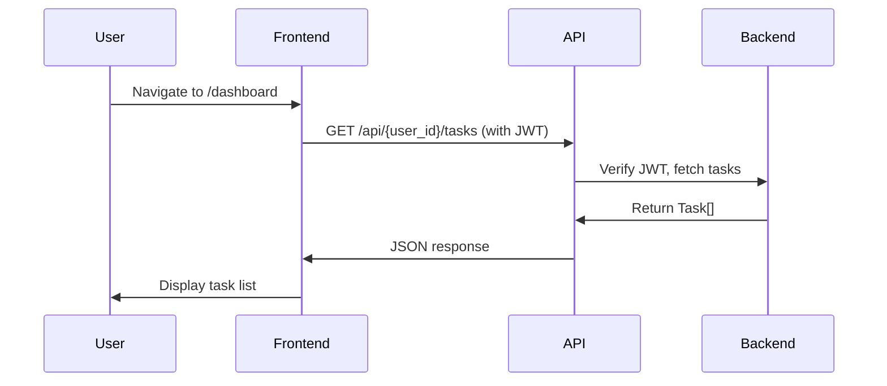
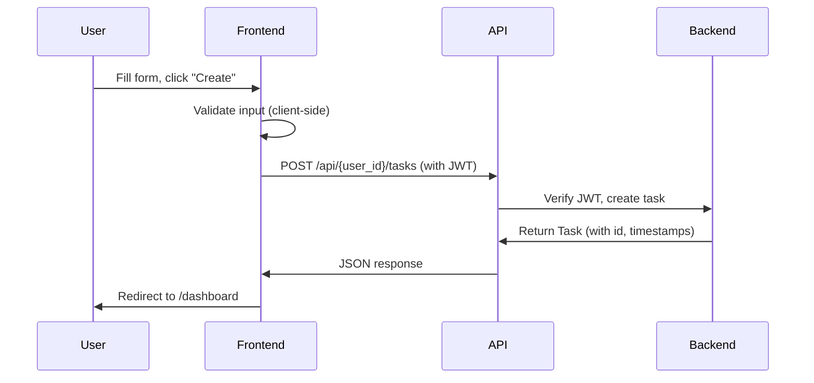
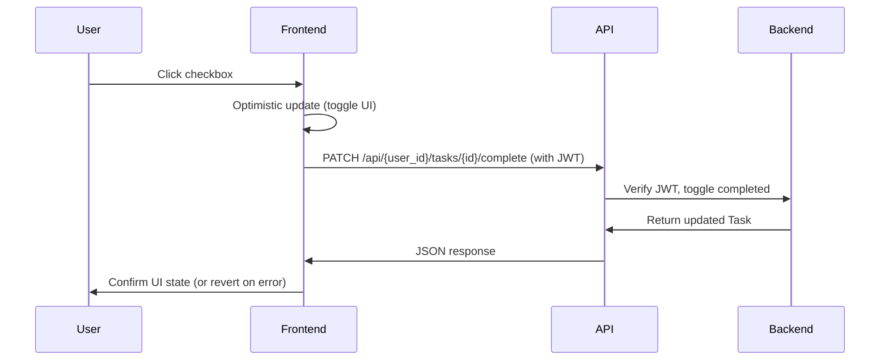

# Data Model: Todo Frontend

**Feature**: `002-todo-frontend`
**Date**: 2026-01-26

## Overview

The frontend data model consists of TypeScript interfaces that mirror the backend entities. These interfaces ensure type safety and provide IntelliSense support during development.

**Principle**: Frontend does not directly access the database. All data flows through the backend REST API.

## Frontend Entities

### Task Entity

**Purpose**: Represents a todo task belonging to a specific user.

**Source**: Mirrors backend `Task` model from `001-todo-api-backend/app/models/todo.py`

**TypeScript Interface**:
```typescript
// types/task.ts
export interface Task {
  /** Unique task identifier (auto-generated by backend) */
  id: number;

  /** Task title (1-1000 characters, required) */
  title: string;

  /** Optional detailed description (max 5000 characters, nullable) */
  description: string | null;

  /** Completion status (default: false) */
  completed: boolean;

  /** User ID who owns this task */
  owner_id: number;

  /** Task creation timestamp (UTC, ISO 8601 format) */
  created_at: string;

  /** Last modification timestamp (UTC, ISO 8601 format) */
  updated_at: string;
}
```

**Field Constraints** (enforced by backend):
- `id`: Positive integer, auto-generated
- `title`: Non-empty string, 1-1000 characters
- `description`: Nullable string, max 5000 characters
- `completed`: Boolean (true = done, false = pending)
- `owner_id`: Positive integer, foreign key to users table
- `created_at`: ISO 8601 datetime string (e.g., "2026-01-26T10:30:00Z")
- `updated_at`: ISO 8601 datetime string

**Example**:
```json
{
  "id": 42,
  "title": "Complete project documentation",
  "description": "Write comprehensive API documentation for the todo backend",
  "completed": false,
  "owner_id": 1,
  "created_at": "2026-01-23T10:30:00Z",
  "updated_at": "2026-01-23T10:30:00Z"
}
```

### Task Creation Input

**Purpose**: Data submitted when creating a new task.

**TypeScript Interface**:
```typescript
// types/task.ts
export interface TaskCreateInput {
  /** Task title (required, 1-1000 characters) */
  title: string;

  /** Optional task description (max 5000 characters) */
  description?: string;
}
```

**Validation Rules** (enforced client-side for UX, backend is source of truth):
- `title`: Required, non-empty, max 1000 characters
- `description`: Optional, max 5000 characters

**Example**:
```json
{
  "title": "Buy groceries",
  "description": "Milk, eggs, bread, cheese"
}
```

**Backend Endpoint**: `POST /api/{user_id}/tasks`

### Task Update Input

**Purpose**: Data submitted when updating an existing task.

**TypeScript Interface**:
```typescript
// types/task.ts
export interface TaskUpdateInput {
  /** Updated task title (optional, 1-1000 characters) */
  title?: string;

  /** Updated task description (optional, max 5000 characters) */
  description?: string;
}
```

**Validation Rules**:
- Both fields optional (partial updates supported)
- `title`: If provided, non-empty, max 1000 characters
- `description`: If provided, max 5000 characters

**Example** (partial update, title only):
```json
{
  "title": "Buy groceries (updated)"
}
```

**Backend Endpoint**: `PUT /api/{user_id}/tasks/{id}`

### User Session

**Purpose**: Represents the authenticated user's session (managed by Better Auth).

**TypeScript Interface**:
```typescript
// types/auth.ts
export interface UserSession {
  user: {
    /** Unique user identifier */
    id: number;

    /** User's email address */
    email: string;
  };

  /** JWT token for backend API authentication */
  token: string;

  /** Session expiration timestamp (ISO 8601) */
  expiresAt: string;
}
```

**Usage**: Better Auth provides this session object after successful signin. Frontend extracts `token` and attaches to all backend API requests.

**Example**:
```json
{
  "user": {
    "id": 1,
    "email": "user@example.com"
  },
  "token": "eyJhbGciOiJIUzI1NiIsInR5cCI6IkpXVCJ9...",
  "expiresAt": "2026-02-02T10:30:00Z"
}
```

## Frontend State Models

### Task List State

**Purpose**: Represents the current state of the task list on the dashboard.

**TypeScript Interface**:
```typescript
// types/state.ts
export interface TaskListState {
  /** Array of tasks (empty if no tasks) */
  tasks: Task[];

  /** Loading state (true during API fetch) */
  loading: boolean;

  /** Error message (null if no error) */
  error: string | null;
}
```

**State Transitions**:
1. **Initial**: `{ tasks: [], loading: true, error: null }`
2. **Success**: `{ tasks: [...], loading: false, error: null }`
3. **Error**: `{ tasks: [], loading: false, error: "Failed to load tasks" }`

### Task Form State

**Purpose**: Represents the state of task creation/edit forms.

**TypeScript Interface**:
```typescript
// types/state.ts
export interface TaskFormState {
  /** Current form data */
  data: TaskCreateInput | TaskUpdateInput;

  /** Validation errors (field name → error message) */
  errors: {
    title?: string;
    description?: string;
  };

  /** Submission state (true during API request) */
  submitting: boolean;

  /** Submission error (null if no error) */
  error: string | null;
}
```

**State Transitions**:
1. **Initial**: `{ data: { title: "", description: "" }, errors: {}, submitting: false, error: null }`
2. **Validation Error**: `{ data: {...}, errors: { title: "Title is required" }, submitting: false, error: null }`
3. **Submitting**: `{ data: {...}, errors: {}, submitting: true, error: null }`
4. **Success**: Redirect to /dashboard
5. **API Error**: `{ data: {...}, errors: {}, submitting: false, error: "Failed to create task" }`

## Data Flow

### Task List Display (GET)



### Task Creation (POST)



### Task Completion Toggle (PATCH)



## Validation Rules

### Client-Side Validation (UX)

**Purpose**: Provide immediate feedback to users before API submission.

**Rules**:
- **Title (required)**:
  - Must not be empty
  - Max 1000 characters
  - Error: "Title is required" or "Title must be 1000 characters or less"

- **Description (optional)**:
  - Max 5000 characters
  - Error: "Description must be 5000 characters or less"

**Implementation**:
```typescript
// lib/validation.ts
export function validateTaskForm(data: TaskCreateInput): { [key: string]: string } {
  const errors: { [key: string]: string } = {};

  if (!data.title || data.title.trim().length === 0) {
    errors.title = "Title is required";
  } else if (data.title.length > 1000) {
    errors.title = "Title must be 1000 characters or less";
  }

  if (data.description && data.description.length > 5000) {
    errors.description = "Description must be 5000 characters or less";
  }

  return errors;
}
```

### Backend Validation (Source of Truth)

**Purpose**: Enforce data integrity and security.

**Rules**: Same as client-side, plus:
- User ID in URL must match JWT user ID (403 Forbidden if mismatch)
- Task must exist (404 Not Found)
- User must own the task (403 Forbidden if accessing another user's task)

**Note**: Backend validation is authoritative. Client-side validation is for UX only.

## Error Handling

### API Error Responses

**Format**: All backend errors return JSON with `detail` field.

**Example Errors**:
```json
// 400 Bad Request
{
  "detail": "Invalid request payload"
}

// 401 Unauthorized
{
  "detail": "Invalid or expired token"
}

// 403 Forbidden
{
  "detail": "Cannot access another user's tasks"
}

// 404 Not Found
{
  "detail": "Task not found"
}

// 422 Unprocessable Entity (validation error)
{
  "detail": [
    {
      "loc": ["body", "title"],
      "msg": "field required",
      "type": "value_error.missing"
    }
  ]
}

// 500 Internal Server Error
{
  "detail": "Internal server error"
}
```

### Frontend Error Handling

**Strategy**: Display user-friendly error messages for all failure scenarios.

**Error Types**:
1. **Network Errors**: "Unable to connect to server. Please check your connection."
2. **Authentication Errors** (401): Redirect to /signin with message "Session expired"
3. **Authorization Errors** (403): "You don't have permission to access this resource"
4. **Not Found** (404): "Task not found"
5. **Validation Errors** (422): Display specific field errors inline
6. **Server Errors** (500): "Something went wrong. Please try again later."

**Implementation**:
```typescript
// lib/api-client.ts
async function handleApiError(response: Response): Promise<never> {
  if (response.status === 401) {
    // Redirect to signin
    window.location.href = "/signin";
    throw new Error("Unauthorized");
  }

  const error = await response.json();

  if (response.status === 422) {
    // Validation error - extract field errors
    const fieldErrors = error.detail.map((e: any) => e.msg).join(", ");
    throw new Error(fieldErrors);
  }

  // Generic error
  throw new Error(error.detail || "Something went wrong");
}
```

## Data Persistence

### Frontend Persistence

**None**: Frontend does not persist data locally (no localStorage, IndexedDB).

**Rationale**:
- Backend is source of truth
- Avoid sync issues between frontend and backend
- Simpler architecture (stateless frontend)

### Backend Persistence

**Source of Truth**: All task data persists in Neon PostgreSQL database via backend API.

**Query Pattern**:
- All queries include `WHERE owner_id = {authenticated_user_id}`
- Ensures user isolation (users never see other users' tasks)

## Type Safety

### Compile-Time Type Checking

**TypeScript** ensures type safety at compile time:
- API responses are typed as `Task`, `Task[]`, etc.
- Form inputs are typed as `TaskCreateInput`, `TaskUpdateInput`
- Component props are explicitly typed

**Example**:
```typescript
// Compile error: missing required field
const task: Task = {
  id: 1,
  title: "Test",
  // Error: Property 'completed' is missing
};

// Compile error: wrong type
const tasks: Task[] = ["not", "a", "task"]; // Error: Type 'string' is not assignable to type 'Task'
```

### Runtime Type Validation

**Optional** (post-MVP): Use Zod for runtime validation if needed.

**Current Approach**: Trust backend API responses (backend validates with Pydantic).

## Summary

| Entity | Purpose | Source |
|--------|---------|--------|
| `Task` | Todo task with title, description, completion status | Backend API |
| `TaskCreateInput` | Data for creating new tasks | Form submission |
| `TaskUpdateInput` | Data for updating existing tasks | Form submission |
| `UserSession` | Authenticated user session with JWT token | Better Auth |
| `TaskListState` | Task list UI state (tasks, loading, error) | React useState |
| `TaskFormState` | Form UI state (data, errors, submitting) | React useState |

**Data Flow**: User → Frontend Form → API Client → Backend API → Database

**Type Safety**: TypeScript interfaces ensure compile-time type checking

**Validation**: Client-side (UX) + Backend (security, source of truth)

**Error Handling**: User-friendly messages for all failure scenarios

**Persistence**: Backend database only (no frontend caching)
